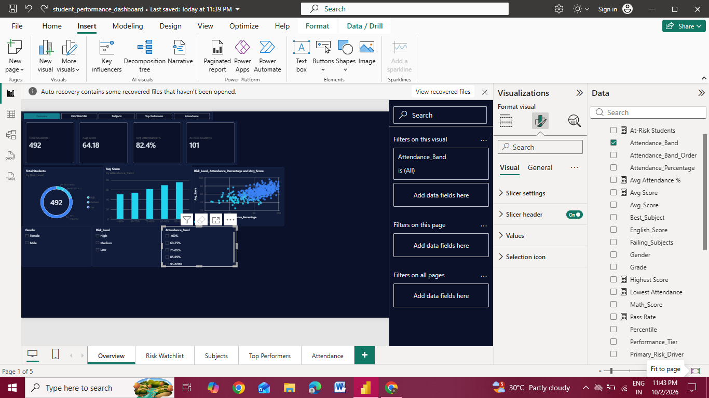
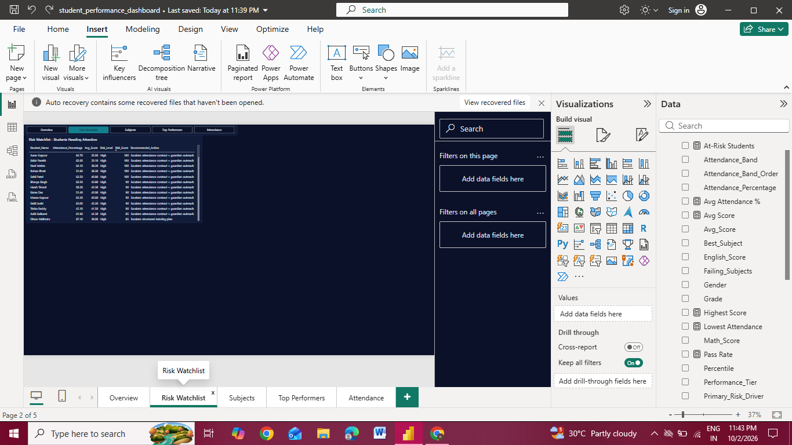
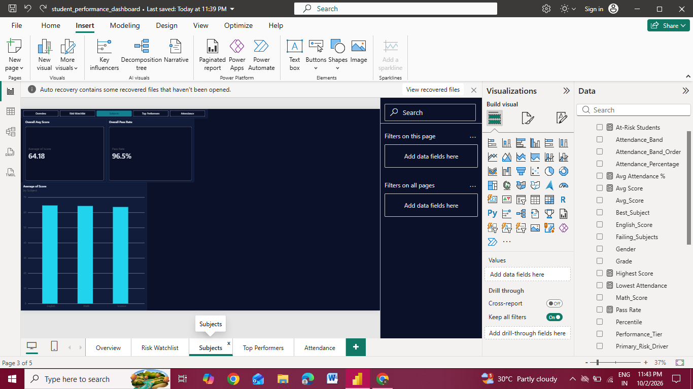
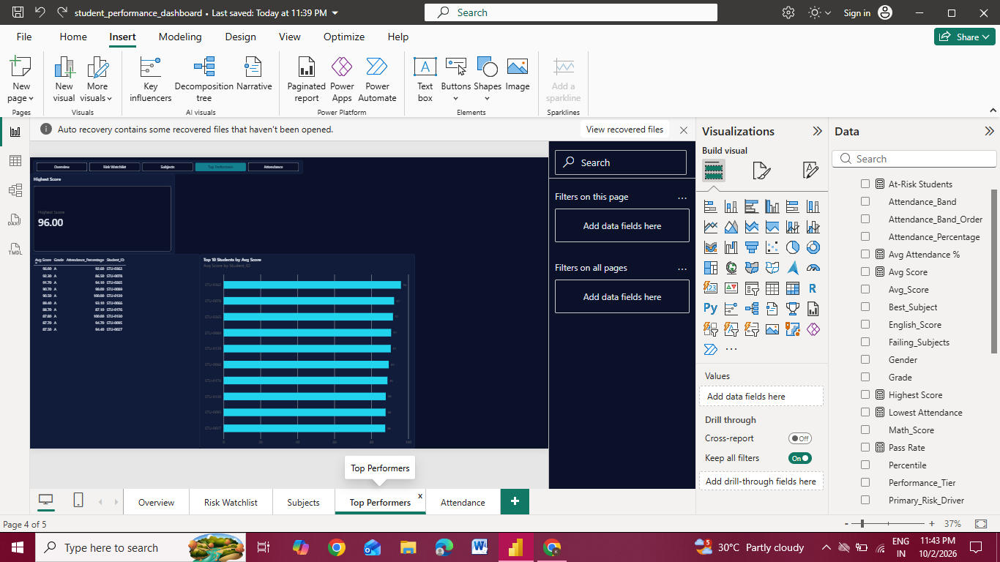
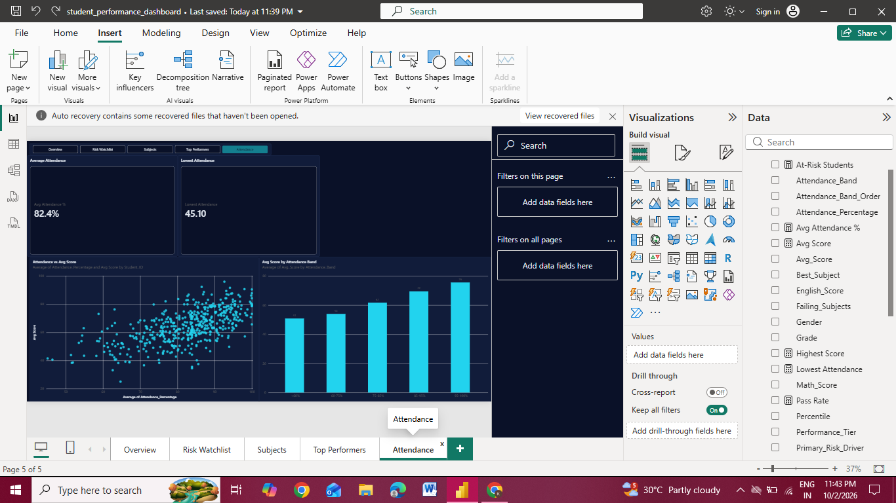

# Student Performance Analytics Dashboard

Python pipeline plus a 5-page Power BI dashboard that analyzes student scores, attendance and academic risk.

## What it does

- Cleans and imputes student data, then engineers features (average score, attendance bands, study efficiency)
- Scores each student's risk level and recommends an action
- Visualizes results in an interactive Power BI dashboard

## Key findings

- Average score: 64.63, overall pass rate: 96.5%
- Average attendance: 82.4%
- Higher attendance bands have clearly higher average scores

## How to run

1. Install requirements: `pip install -r requirements.txt`
2. Run the pipeline: `python main.py`
3. Open `powerbi/student_performance_dashboard.pbix` in Power BI Desktop

## Dashboard pages

